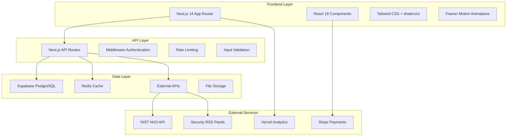

# Design Document

## Overview

The CyberNex Academy professional platform rebuild focuses on creating a perfect free tier experience as the foundation for future premium features. The design maintains the existing three-section structure (Community, Insights, Academy) while enhancing navigation, user experience, and content organization. This approach provides immediate value to users while establishing a solid technical foundation for premium features.

The rebuild prioritizes the free user experience with improved UI/UX, real-time threat intelligence, enhanced resource discovery, and mobile-first design while maintaining the current dark theme and component architecture.

## Architecture

### System Architecture Overview



### Component Architecture

```
components/
├── dashboard/
│   ├── MainDashboard.tsx           # Three-section card layout
│   ├── SectionCard.tsx             # Reusable section card component
│   └── QuickActions.tsx            # User shortcuts and bookmarks
├── sections/
│   ├── CommunityCards.tsx          # Community subsection cards
│   ├── InsightsCards.tsx           # Insights subsection cards
│   ├── AcademyCards.tsx            # Academy subsection cards
│   └── LiveNewsFeed.tsx            # Real-time threat intelligence
├── resources/
│   ├── ResourceCard.tsx            # Individual resource display
│   ├── ResourceSearch.tsx          # Search and filter functionality
│   ├── BookmarkButton.tsx          # Bookmark management
│   └── ResourceFilters.tsx         # Content filtering
├── navigation/
│   ├── Navbar.tsx                  # Main navigation (updated)
│   ├── Breadcrumbs.tsx             # Section navigation
│   └── MobileMenu.tsx              # Mobile navigation
└── ui/                             # Existing shadcn/ui components
```

### Page Structure

```
app/
├── page.tsx                        # Main dashboard with 3 section cards
├── dashboard/
│   └── page.tsx                    # User personal dashboard
├── community/
│   ├── page.tsx                    # Community section overview
│   ├── discord-servers/page.tsx    # Discord communities
│   ├── reddit-communities/page.tsx # Reddit communities
│   ├── github-resources/page.tsx   # GitHub repositories
│   ├── learning-forums/page.tsx    # Discussion forums
│   ├── skool-communities/page.tsx  # Skool integration
│   └── events-meetups/page.tsx     # Events and meetups
├── insights/
│   ├── page.tsx                    # Insights section with live feed
│   ├── cybersecurity-news/page.tsx # Latest security news
│   ├── industry-insights/page.tsx  # Industry analysis
│   ├── threat-intelligence/page.tsx # Threat data
│   ├── security-breaches/page.tsx  # Incident reports
│   ├── emerging-trends/page.tsx    # Technology trends
│   └── research-reports/page.tsx   # Academic research
└── academy/
    ├── page.tsx                    # Academy section overview
    ├── learning-paths/page.tsx     # Structured curricula
    ├── tutorials/page.tsx          # Step-by-step guides
    ├── labs-exercises/page.tsx     # Hands-on practice
    ├── youtube-resources/page.tsx  # Video content
    ├── documentation/page.tsx      # Reference materials
    ├── cheat-sheets/page.tsx       # Quick references
    ├── glossary/page.tsx           # Term definitions
    ├── learning-forums/page.tsx    # Educational discussions
    └── security-tools/page.tsx     # Tool reviews and guides
```

## Components and Interfaces

### 1. MainDashboard Component

**Purpose**: Central hub displaying three main section cards with real-time statistics

**Interface**:
```typescript
interface SectionStats {
  community: {
    totalMembers: number
    activeDiscussions: number
    dailyActiveUsers: number
    expertCount: number
  }
  insights: {
    totalThreats: number
    criticalThreats: number
    newCves: number
    activeCampaigns: number
  }
  academy: {
    learningPaths: number
    totalCourses: number
    totalArticles: number
    premiumContent: number
  }
}

interface MainDashboardProps {
  user?: User
  stats: SectionStats
  loading?: boolean
}
```

**Features**:
- Real-time statistics display for each section
- Hover animations and visual feedback
- Responsive card layout (3 columns desktop, 1 column mobile)
- Quick actions for authenticated users
- Loading states and error handling

### 2. LiveNewsFeed Component

**Purpose**: Real-time cybersecurity threat intelligence feed for Insights section

**Interface**:
```typescript
interface NewsItem {
  id: string
  title: string
  summary: string
  source: string
  publishedAt: Date
  severity: 'critical' | 'high' | 'medium' | 'low'
  category: string
  url: string
  cveId?: string
  affectedSystems?: string[]
  tags: string[]
}

interface LiveNewsFeedProps {
  maxItems?: number
  autoRefresh?: boolean
  refreshInterval?: number
  showSeverityFilter?: boolean
  compact?: boolean
}
```

**Data Sources**:
- NIST NVD API for CVE vulnerabilities
- Security RSS feeds (Krebs on Security, The Record, etc.)
- Threat intelligence APIs
- Security vendor blogs and advisories

**Features**:
- Auto-refresh every 5 minutes
- Severity-based color coding
- Real-time updates with smooth animations
- Mobile-optimized layout
- Click-through tracking for analytics

### 3. ResourceSearch Component

**Purpose**: Enhanced search and filtering across all sections

**Interface**:
```typescript
interface SearchFilters {
  query: string
  section?: 'community' | 'insights' | 'academy'
  difficulty?: 'beginner' | 'intermediate' | 'advanced'
  contentType?: 'article' | 'video' | 'tool' | 'course' | 'discussion'
  tags: string[]
  dateRange?: {
    start: Date
    end: Date
  }
}

interface ResourceSearchProps {
  onSearch: (filters: SearchFilters) => void
  initialFilters?: Partial<SearchFilters>
  showAdvancedFilters?: boolean
  placeholder?: string
}
```

**Features**:
- Real-time search with debouncing
- Advanced filtering options
- Search history and suggestions
- Mobile-friendly filter interface
- Analytics tracking for search queries

### 4. BookmarkSystem Component

**Purpose**: User bookmark management across all sections

**Interface**:
```typescript
interface Bookmark {
  id: string
  userId: string
  resourceId: string
  resourceTitle: string
  resourceUrl: string
  section: 'community' | 'insights' | 'academy'
  subsection: string
  tags: string[]
  notes?: string
  createdAt: Date
}

interface BookmarkSystemProps {
  userId: string
  resourceId: string
  resourceTitle: string
  resourceUrl: string
  section: string
  subsection: string
}
```

**Features**:
- One-click bookmarking
- Bookmark organization by section
- Personal notes on bookmarks
- Bookmark sharing capabilities
- Export functionality

## Data Models

### 1. Enhanced Resource Model

```typescript
interface Resource {
  id: string
  title: string
  slug: string
  description: string
  content?: string
  resourceType: 'course' | 'article' | 'video' | 'tool' | 'community' | 'documentation' | 'cheat_sheet' | 'podcast' | 'threat' | 'breach'
  url?: string
  thumbnailUrl?: string
  difficultyLevel: 'beginner' | 'intermediate' | 'advanced'
  estimatedTimeMinutes?: number
  isPremium: boolean
  isFeatured: boolean
  isPublished: boolean
  viewCount: number
  likeCount: number
  bookmarkCount: number
  authorId?: string
  categoryId?: string
  section: 'community' | 'insights' | 'academy'
  subsection: string
  tags: string[]
  qualityScore: number
  lastUpdated: Date
  verifiedSource: boolean
  seoTitle?: string
  seoDescription?: string
  seoKeywords?: string[]
  createdAt: Date
  updatedAt: Date
  publishedAt?: Date
}
```

### 2. User Activity Tracking

```typescript
interface UserActivity {
  id: string
  userId: string
  activityType: 'view' | 'bookmark' | 'like' | 'share' | 'search' | 'click'
  resourceId?: string
  section: 'community' | 'insights' | 'academy'
  subsection?: string
  metadata: {
    searchQuery?: string
    timeSpent?: number
    clickedUrl?: string
    deviceType: 'desktop' | 'tablet' | 'mobile'
    referrer?: string
  }
  timestamp: Date
}
```

### 3. Section Statistics

```typescript
interface SectionStatistics {
  id: string
  section: 'community' | 'insights' | 'academy'
  date: Date
  metrics: {
    totalResources: number
    activeUsers: number
    newResources: number
    totalViews: number
    totalBookmarks: number
    averageTimeSpent: number
    topTags: string[]
    popularResources: string[]
  }
  realTimeData: {
    currentActiveUsers: number
    recentActivity: UserActivity[]
    trendingResources: string[]
  }
}
```

## Error Handling

### 1. Graceful Degradation Strategy

**API Failures**:
```typescript
const fetchWithFallback = async <T>(
  apiCall: () => Promise<T>,
  fallbackData: T,
  cacheKey?: string
): Promise<T> => {
  try {
    const data = await apiCall()
    if (cacheKey) {
      await cacheData(cacheKey, data, 300) // 5 minutes
    }
    return data
  } catch (error) {
    console.error('API call failed:', error)
    
    // Try cached data first
    if (cacheKey) {
      const cachedData = await getCachedData<T>(cacheKey)
      if (cachedData) return cachedData
    }
    
    // Return fallback data
    return fallbackData
  }
}
```

**Component Error Boundaries**:
```typescript
const SectionErrorBoundary: React.FC<{
  section: string
  fallback: React.ReactNode
  children: React.ReactNode
}> = ({ section, fallback, children }) => {
  return (
    <ErrorBoundary
      fallback={fallback}
      onError={(error, errorInfo) => {
        logError(`${section}_error`, error, errorInfo)
        trackEvent('component_error', { section, error: error.message })
      }}
    >
      {children}
    </ErrorBoundary>
  )
}
```

### 2. Loading States and Skeletons

**Dashboard Loading**:
```typescript
const DashboardSkeleton = () => (
  <div className="grid md:grid-cols-3 gap-6">
    {[...Array(3)].map((_, i) => (
      <div key={i} className="animate-pulse">
        <div className="bg-gray-800 rounded-lg p-6">
          <div className="h-8 bg-gray-700 rounded w-3/4 mb-4"></div>
          <div className="h-4 bg-gray-700 rounded w-full mb-2"></div>
          <div className="h-4 bg-gray-700 rounded w-2/3"></div>
        </div>
      </div>
    ))}
  </div>
)
```

## Testing Strategy

### 1. Component Testing

**Test Coverage Requirements**:
- Unit tests for all components (>90% coverage)
- Integration tests for user flows
- Visual regression testing
- Accessibility testing
- Performance testing

**Example Test Structure**:
```typescript
describe('MainDashboard', () => {
  it('renders three section cards with correct statistics', async () => {
    const mockStats = createMockSectionStats()
    render(<MainDashboard stats={mockStats} />)
    
    expect(screen.getByText('Community')).toBeInTheDocument()
    expect(screen.getByText('50,000+ members')).toBeInTheDocument()
    expect(screen.getByText('Insights')).toBeInTheDocument()
    expect(screen.getByText('Academy')).toBeInTheDocument()
  })

  it('handles loading state gracefully', () => {
    render(<MainDashboard stats={mockStats} loading={true} />)
    expect(screen.getByTestId('dashboard-skeleton')).toBeInTheDocument()
  })

  it('navigates to correct section on card click', async () => {
    const user = userEvent.setup()
    render(<MainDashboard stats={mockStats} />)
    
    await user.click(screen.getByText('Community'))
    expect(mockRouter.push).toHaveBeenCalledWith('/community')
  })
})
```

### 2. Performance Testing

**Metrics to Monitor**:
- First Contentful Paint (FCP) < 1.5s
- Largest Contentful Paint (LCP) < 2.5s
- Cumulative Layout Shift (CLS) < 0.1
- First Input Delay (FID) < 100ms
- Time to Interactive (TTI) < 3s

**Performance Budget**:
- JavaScript bundle < 250KB gzipped
- CSS bundle < 50KB gzipped
- Images optimized with WebP/AVIF
- API response times < 500ms

### 3. User Experience Testing

**Key User Flows**:
1. Landing → Registration → Dashboard → Section Navigation
2. Search → Filter → Resource Discovery → Bookmark
3. Mobile Navigation → Content Consumption → Engagement
4. Live Feed → News Article → External Link Tracking

## Implementation Approach

The implementation will focus on building core components and features that enhance the free tier experience while maintaining the existing technical foundation. The approach prioritizes user experience, performance, and scalability without prescriptive timelines.

## Technical Considerations

### 1. Performance Optimization

**Caching Strategy**:
```typescript
// Multi-layer caching approach
const cacheConfig = {
  browser: {
    staticAssets: '1 year',
    apiResponses: '5 minutes',
    userContent: '1 hour'
  },
  cdn: {
    images: '1 month',
    css: '1 year',
    js: '1 year'
  },
  redis: {
    sectionStats: '5 minutes',
    newsFeeds: '2 minutes',
    userSessions: '24 hours'
  }
}
```

**Code Splitting**:
```typescript
// Route-based code splitting
const CommunityPage = lazy(() => import('./community/page'))
const InsightsPage = lazy(() => import('./insights/page'))
const AcademyPage = lazy(() => import('./academy/page'))

// Component-based splitting for heavy features
const LiveNewsFeed = lazy(() => import('./components/LiveNewsFeed'))
const ResourceSearch = lazy(() => import('./components/ResourceSearch'))
```

### 2. Real-time Updates

**WebSocket Implementation**:
```typescript
// Real-time updates for live feed
const useRealTimeUpdates = (feedType: string) => {
  const [data, setData] = useState([])
  
  useEffect(() => {
    const ws = new WebSocket(`${WS_URL}/feed/${feedType}`)
    
    ws.onmessage = (event) => {
      const newItem = JSON.parse(event.data)
      setData(prev => [newItem, ...prev.slice(0, 9)]) // Keep 10 items
    }
    
    return () => ws.close()
  }, [feedType])
  
  return data
}
```

### 3. Security Implementation

**API Security**:
```typescript
// Rate limiting and input validation
export async function POST(request: Request) {
  // Rate limiting
  const rateLimitResult = await rateLimit(request)
  if (!rateLimitResult.success) {
    return NextResponse.json({ error: 'Rate limit exceeded' }, { status: 429 })
  }
  
  // Input validation
  const body = await request.json()
  const validatedData = searchSchema.parse(body)
  
  // Authentication check
  const user = await getUser(request)
  if (!user) {
    return NextResponse.json({ error: 'Unauthorized' }, { status: 401 })
  }
  
  // Process request
  const results = await searchResources(validatedData)
  return NextResponse.json(results)
}
```

**Data Sanitization**:
```typescript
// Sanitize external content
const sanitizeNewsContent = (content: string): string => {
  return DOMPurify.sanitize(content, {
    ALLOWED_TAGS: ['p', 'br', 'strong', 'em', 'a'],
    ALLOWED_ATTR: ['href', 'target'],
    ALLOW_DATA_ATTR: false
  })
}
```

This design provides a comprehensive foundation for the free tier rebuild while maintaining scalability for future premium features. The focus on user experience, performance, and security ensures a professional platform that can compete with industry leaders while providing clear value to users.