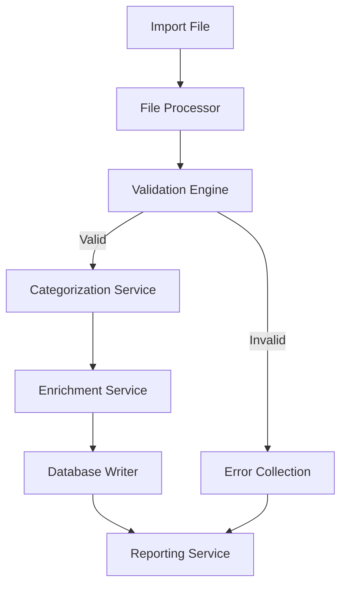

# Design Document: Resource Import System

## Overview

The Resource Import System is designed to efficiently process and import large volumes of resources (1,000+) into the application's database. The system will handle validation, categorization, and enrichment of resource data to ensure proper integration with the existing application. The design focuses on reliability, performance, and data integrity while providing administrators with visibility and control over the import process.

## Architecture

The Resource Import System will follow a modular architecture with the following components:

1. **Import Service**: Core service responsible for orchestrating the import process
2. **File Processors**: Specialized modules for handling different file formats (CSV, JSON, XLSX)
3. **Validation Engine**: Validates resource data against schema requirements
4. **Categorization Service**: Assigns appropriate categories to resources
5. **Enrichment Service**: Enhances resource metadata
6. **Database Writer**: Handles efficient batch writing to the database
7. **Reporting Service**: Generates import reports and logs

The system will use a pipeline architecture where resources flow through stages of processing (validation → categorization → enrichment → storage), with error handling at each stage.



## Components and Interfaces

### Import Service

The Import Service acts as the orchestrator for the entire import process.

```typescript
interface ImportOptions {
  batchSize: number;
  createMissingCategories: boolean;
  defaultVisibility: 'published' | 'unpublished';
  skipDuplicates: boolean;
  validateOnly: boolean;
}

class ResourceImportService {
  constructor(options: ImportOptions);
  async importFile(filePath: string): Promise<ImportResult>;
  async importData(resources: RawResource[]): Promise<ImportResult>;
  pauseImport(): void;
  resumeImport(): void;
  cancelImport(): void;
  getProgress(): ImportProgress;
}
```

### File Processors

File processors handle different file formats and convert them to a standardized internal representation.

```typescript
interface FileProcessor {
  canProcess(filePath: string): boolean;
  process(filePath: string): Promise<RawResource[]>;
}

class CsvProcessor implements FileProcessor { /* ... */ }
class JsonProcessor implements FileProcessor { /* ... */ }
class XlsxProcessor implements FileProcessor { /* ... */ }
```

### Validation Engine

The Validation Engine ensures that resource data meets the required schema and business rules.

```typescript
interface ValidationRule {
  field: string;
  validate(value: any): boolean;
  errorMessage: string;
}

class ResourceValidator {
  constructor(rules: ValidationRule[]);
  validate(resource: RawResource): ValidationResult;
  validateBatch(resources: RawResource[]): ValidationResult[];
}
```

### Categorization Service

The Categorization Service assigns categories to resources based on their metadata.

```typescript
interface CategorizationStrategy {
  categorize(resource: ValidatedResource): string[];
}

class ResourceCategorizer {
  constructor(strategies: CategorizationStrategy[]);
  async categorize(resource: ValidatedResource): Promise<CategorizedResource>;
  async createMissingCategories(categoryNames: string[]): Promise<void>;
}
```

### Enrichment Service

The Enrichment Service enhances resource metadata to improve discoverability and usefulness.

```typescript
interface EnrichmentProvider {
  canEnrich(resource: CategorizedResource): boolean;
  enrich(resource: CategorizedResource): Promise<EnrichedResource>;
}

class ResourceEnricher {
  constructor(providers: EnrichmentProvider[]);
  async enrich(resource: CategorizedResource): Promise<EnrichedResource>;
}
```

### Database Writer

The Database Writer efficiently writes resources to the database in batches.

```typescript
class DatabaseWriter {
  constructor(batchSize: number);
  async writeResources(resources: EnrichedResource[]): Promise<WriteResult>;
  async updateExistingResources(resources: EnrichedResource[]): Promise<WriteResult>;
}
```

### Reporting Service

The Reporting Service generates reports on the import process.

```typescript
class ImportReporter {
  constructor(logLevel: 'verbose' | 'normal' | 'minimal');
  recordSuccess(resource: EnrichedResource): void;
  recordError(resource: RawResource, error: ValidationError): void;
  generateSummaryReport(): ImportSummary;
  generateDetailedReport(): DetailedImportReport;
}
```

## Data Models

### Resource Models

The system will use the following data models throughout the import pipeline:

```typescript
interface RawResource {
  title: string;
  description: string;
  url: string;
  resource_type?: string;
  categories?: string[];
  tags?: string[];
  difficulty_level?: string;
  estimated_time_minutes?: number;
  is_premium?: boolean;
  is_published?: boolean;
  author_id?: string;
  [key: string]: any; // Additional fields
}

interface ValidatedResource extends RawResource {
  validation: {
    isValid: boolean;
    errors: ValidationError[];
  };
}

interface CategorizedResource extends ValidatedResource {
  categories: {
    id: string;
    name: string;
  }[];
}

interface EnrichedResource extends CategorizedResource {
  slug: string;
  view_count: number;
  like_count: number;
  bookmark_count: number;
  created_at: string;
  updated_at: string;
}
```

### Database Schema

The import system will interact with the following database tables:

- `resources`: Main table for resource data
- `categories`: Categories for organizing resources
- `resource_categories`: Junction table for many-to-many relationship
- `tags`: Tags for additional resource classification
- `resource_tags`: Junction table for many-to-many relationship

## Error Handling

The system will implement a comprehensive error handling strategy:

1. **Validation Errors**: Collected and reported without halting the import process
2. **Database Errors**: Retried with exponential backoff before failing
3. **File Processing Errors**: Reported with specific line/record information
4. **System Errors**: Logged with stack traces and reported to administrators

Errors will be categorized as:
- **Fatal**: Errors that prevent the import process from continuing
- **Record-Level**: Errors that affect individual resources but allow the process to continue
- **Warning**: Issues that don't prevent import but may affect quality

## Testing Strategy

The testing strategy will include:

1. **Unit Tests**: For individual components (validators, processors, etc.)
2. **Integration Tests**: For component interactions
3. **End-to-End Tests**: For complete import workflows
4. **Performance Tests**: To ensure the system can handle large volumes
5. **Error Handling Tests**: To verify proper error management

Test data sets will include:
- Valid resource data with various attributes
- Invalid data with different types of errors
- Edge cases (empty fields, maximum sizes, etc.)
- Large data sets for performance testing

## Implementation Considerations

### Performance Optimization

For handling 1,000+ resources efficiently:

1. **Batch Processing**: Resources will be processed in configurable batches (default: 100)
2. **Database Optimization**: Bulk inserts and updates will be used
3. **Parallel Processing**: Where possible, operations will be parallelized
4. **Memory Management**: Streaming approaches for file processing to minimize memory usage
5. **Database Indexing**: Ensure proper indexes are in place for efficient lookups

### Security Considerations

1. **Input Validation**: Strict validation of all imported data
2. **Access Control**: Only administrators can initiate imports
3. **Rate Limiting**: Prevent system overload from multiple simultaneous imports
4. **Data Sanitization**: Clean and sanitize all text fields before storage

### Monitoring and Logging

1. **Progress Tracking**: Real-time progress updates during import
2. **Audit Logging**: Detailed logs of all import operations
3. **Performance Metrics**: Tracking of processing time and resource usage
4. **Error Reporting**: Comprehensive error reporting with context

## User Interface

While this design focuses on the backend implementation, the system will expose endpoints for a frontend interface that provides:

1. **File Upload**: Interface for uploading import files
2. **Import Configuration**: Options for customizing the import process
3. **Progress Monitoring**: Real-time progress updates
4. **Error Reporting**: Detailed error reports with filtering and export options
5. **Import History**: Record of past imports with results

## Deployment and Scaling

The import system will be designed to scale horizontally for handling very large imports:

1. **Worker Processes**: Multiple worker processes can handle different batches
2. **Queue System**: A queue system can be used for very large imports
3. **Database Connection Pooling**: Efficient use of database connections
4. **Resource Monitoring**: Automatic scaling based on system load

## Future Enhancements

Potential future enhancements include:

1. **AI-Powered Categorization**: Using machine learning for more accurate categorization
2. **Content Extraction**: Automatically extracting content from URLs
3. **Scheduled Imports**: Setting up recurring imports from external sources
4. **Import Templates**: Saving import configurations as templates
5. **Data Transformation Rules**: Custom rules for transforming data during import