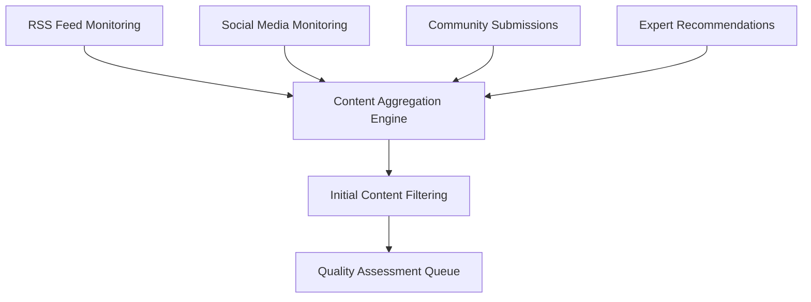
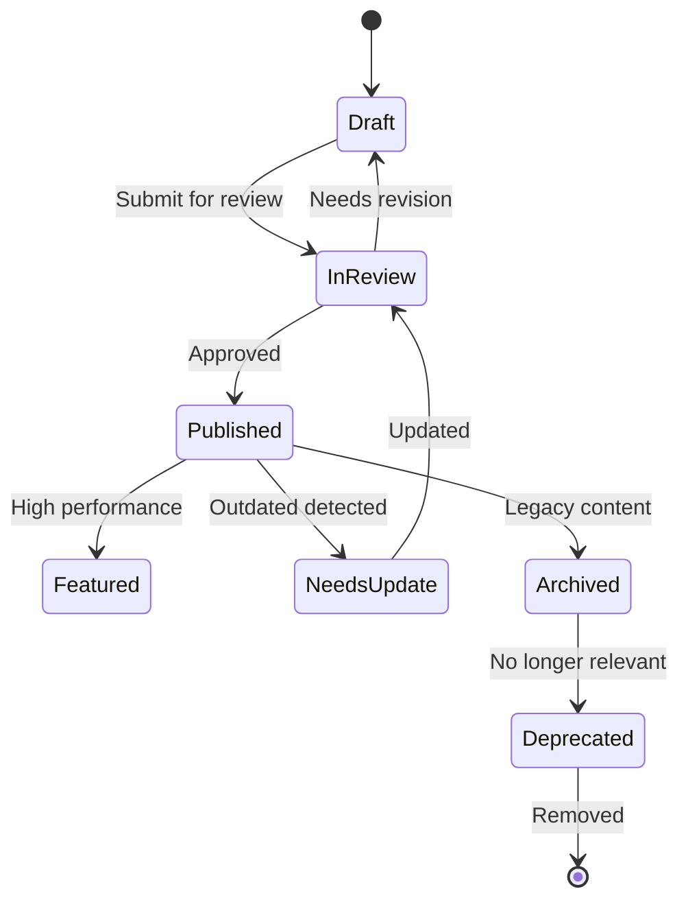

# Content Curation & Quality Assurance Workflow

## Overview
This document outlines the systematic approach for content curation, quality assurance, and ongoing maintenance to ensure Cybernex Academy maintains the highest standards of content quality and relevance.

## Content Submission Workflow

### 1. Content Discovery & Sourcing

#### Automated Content Discovery


#### Manual Content Sourcing
- **Expert Network**: Submissions from verified cybersecurity professionals
- **Community Contributions**: User-submitted resources with incentive system
- **Partnership Content**: Curated content from industry partners
- **Original Content**: Internally created educational materials

### 2. Content Evaluation Criteria

#### Technical Accuracy (40% weight)
- [ ] Information is factually correct and up-to-date
- [ ] Technical procedures are tested and validated
- [ ] Sources are authoritative and credible
- [ ] No contradictory information with established best practices

#### Relevance & Value (30% weight)
- [ ] Directly applicable to cybersecurity professionals
- [ ] Addresses current industry needs and challenges
- [ ] Provides actionable insights or knowledge
- [ ] Fills identified content gaps in platform

#### Quality & Usability (20% weight)
- [ ] Well-structured and easy to follow
- [ ] Clear writing and professional presentation
- [ ] Appropriate for target skill level
- [ ] Includes practical examples or applications

#### Uniqueness & Innovation (10% weight)
- [ ] Offers new perspectives or approaches
- [ ] Not readily available elsewhere
- [ ] Contributes to knowledge advancement
- [ ] Demonstrates thought leadership

### 3. Review Process

#### Stage 1: Automated Pre-screening
**Automated Checks**:
- Content freshness (publication date within criteria)
- Source reputation scoring
- Duplicate content detection
- Basic quality indicators (length, structure, links)

**Auto-approval Criteria**:
- High-reputation sources (SANS, NIST, OWASP)
- Previously approved authors
- Content types with low risk (news updates, tool releases)

#### Stage 2: Expert Technical Review
**Reviewer Qualifications**:
- Relevant cybersecurity certifications (CISSP, CEH, OSCP, etc.)
- 5+ years industry experience
- Demonstrated expertise in content domain
- Previous successful review history

**Review Checklist**:
```markdown
## Technical Review Checklist

### Content Accuracy
- [ ] Technical information is correct and current
- [ ] Procedures and techniques are properly explained
- [ ] Tools and commands are accurately represented
- [ ] Security implications are properly addressed

### Completeness
- [ ] All necessary context is provided
- [ ] Prerequisites are clearly stated
- [ ] Expected outcomes are defined
- [ ] Limitations and caveats are mentioned

### Practical Value
- [ ] Information is actionable and applicable
- [ ] Examples are relevant and helpful
- [ ] Skills/knowledge transfer is effective
- [ ] Real-world applicability is clear

### Ethical Considerations
- [ ] Content promotes ethical practices
- [ ] Potential misuse is addressed
- [ ] Legal considerations are mentioned
- [ ] Responsible disclosure principles followed
```

#### Stage 3: Editorial Review
**Focus Areas**:
- Content structure and organization
- Writing clarity and accessibility
- Target audience alignment
- SEO optimization
- Metadata completeness

#### Stage 4: User Experience Testing
**Beta User Testing**:
- Sample users from target skill level
- Practical component validation
- Usability feedback collection
- Learning effectiveness assessment

### 4. Content Quality Scoring System

#### Scoring Matrix (1-100 scale)

**Technical Accuracy (40 points)**
- Excellent (36-40): Fully accurate, expert-validated
- Good (28-35): Mostly accurate, minor issues
- Fair (20-27): Generally accurate, some concerns
- Poor (0-19): Significant accuracy issues

**Relevance & Value (30 points)**
- Excellent (27-30): Highly relevant, immediate value
- Good (21-26): Relevant, clear value proposition
- Fair (15-20): Somewhat relevant, limited value
- Poor (0-14): Low relevance or value

**Quality & Usability (20 points)**
- Excellent (18-20): Professional, easy to use
- Good (14-17): Well-structured, minor issues
- Fair (10-13): Adequate structure, some problems
- Poor (0-9): Poor structure or presentation

**Innovation & Uniqueness (10 points)**
- Excellent (9-10): Highly innovative, unique insights
- Good (7-8): Some innovation, good perspectives
- Fair (5-6): Standard approach, limited innovation
- Poor (0-4): No innovation, redundant content

#### Quality Thresholds
- **Premium Content**: 85+ score required
- **Standard Content**: 70+ score required
- **Community Content**: 55+ score required
- **Rejected Content**: Below 55 score

## Content Maintenance Workflow

### 1. Scheduled Reviews

#### Quarterly Comprehensive Audit
```markdown
## Quarterly Audit Checklist

### Content Freshness Review
- [ ] Identify content >12 months old
- [ ] Verify technical accuracy of older content
- [ ] Update deprecated information
- [ ] Archive or update outdated content

### Performance Analysis
- [ ] Review user engagement metrics
- [ ] Identify low-performing content
- [ ] Analyze user feedback and ratings
- [ ] Determine improvement opportunities

### Gap Analysis
- [ ] Identify missing content areas
- [ ] Assess competitor content coverage
- [ ] Plan new content development
- [ ] Prioritize content creation efforts

### Quality Assurance
- [ ] Validate all external links
- [ ] Test interactive components
- [ ] Verify download links and resources
- [ ] Update contact information and references
```

#### Monthly Performance Review
- User engagement analytics
- Content completion rates
- User feedback analysis
- Quality score trends

### 2. Trigger-Based Updates

#### Technology Updates
**Triggers**:
- New software versions released
- Security vulnerabilities disclosed
- Industry standard updates
- Regulatory changes

**Response Timeline**:
- Critical security updates: 24 hours
- Major version updates: 1 week
- Standard updates: 2 weeks
- Minor updates: 1 month

#### User Feedback Response
**Feedback Categories**:
- Technical corrections (24-48 hour response)
- Clarity improvements (1 week response)
- Additional content requests (2 weeks response)
- General suggestions (monthly review)

### 3. Content Lifecycle Management

#### Content States and Transitions


#### Archival Criteria
- Content older than 2 years with low engagement
- Superseded by newer, better content
- Technology no longer in use or relevant
- Regulatory or compliance changes

#### Deprecation Process
1. **Warning Phase** (30 days): Users notified of pending removal
2. **Grace Period** (60 days): Content marked as deprecated but accessible
3. **Removal**: Content removed from public access
4. **Retention**: Archived internally for potential future reference

## Quality Assurance Team Structure

### Roles and Responsibilities

#### Content Manager (1 FTE)
**Responsibilities**:
- Overall content strategy and quality oversight
- Review workflow management
- Quality metrics monitoring
- Team coordination and training

**Qualifications**:
- 7+ years cybersecurity experience
- Content management or editorial background
- Strong understanding of adult learning principles
- Project management skills

#### Technical Reviewers (3-5 contractors)
**Responsibilities**:
- Expert technical validation
- Accuracy verification
- Best practice alignment
- Security consideration assessment

**Qualifications**:
- Domain-specific expertise (network, application, cloud security)
- Industry certifications (CISSP, CEH, OSCP, CISM)
- Minimum 5 years hands-on experience
- Previous technical writing or review experience

#### Editorial Reviewer (1 contractor)
**Responsibilities**:
- Content structure and clarity review
- Grammar and style editing
- SEO optimization
- Metadata validation

**Qualifications**:
- Technical writing background
- Cybersecurity industry knowledge
- SEO and content marketing experience
- Strong communication skills

#### Community Moderators (2-3 part-time)
**Responsibilities**:
- Community-submitted content review
- User feedback management
- Basic quality screening
- Community engagement

**Qualifications**:
- Cybersecurity enthusiasm and basic knowledge
- Community management experience
- Good judgment and communication skills
- Ability to identify quality content

## Content Performance Metrics

### Quality Metrics
- **Average Quality Score**: Target 80+
- **Review Completion Time**: Target 72 hours
- **Content Accuracy Rate**: Target 98%+
- **User Satisfaction Rating**: Target 4.5+ stars

### Engagement Metrics
- **Content Completion Rate**: Target 70%+
- **User Return Rate**: Target 60%+
- **Social Sharing Rate**: Target 15%+
- **Bookmark/Save Rate**: Target 25%+

### Operational Metrics
- **Review Throughput**: Target 50+ items/week
- **Content Update Frequency**: Target 95% updated annually
- **Link Validation Rate**: Target 99%+ working links
- **Response Time to Issues**: Target 24 hours

## Tools and Technology

### Content Management System
- **Review Dashboard**: Track content through review pipeline
- **Quality Scoring Interface**: Standardized evaluation forms
- **Performance Analytics**: Content engagement and user behavior
- **Automation Tools**: Link checking, duplicate detection, freshness monitoring

### Review Tools
- **Technical Validation**: Lab environments for testing procedures
- **Plagiarism Detection**: Automated duplicate content identification
- **Link Verification**: Automated link checking and validation
- **SEO Analysis**: Content optimization recommendations

### Communication Tools
- **Reviewer Portal**: Assignment management and feedback collection
- **User Feedback System**: Rating, comments, and improvement suggestions
- **Alert System**: Notifications for urgent content issues
- **Reporting Dashboard**: Quality metrics and performance tracking

## Implementation Timeline

### Phase 1: Foundation (Weeks 1-2)
- [ ] Establish review team and roles
- [ ] Create review criteria and checklists
- [ ] Set up basic content management workflows
- [ ] Begin audit of existing content

### Phase 2: Process Implementation (Weeks 3-4)
- [ ] Launch formal review process
- [ ] Implement quality scoring system
- [ ] Begin systematic content evaluation
- [ ] Train review team on procedures

### Phase 3: Automation & Optimization (Weeks 5-6)
- [ ] Deploy automated screening tools
- [ ] Optimize review workflows based on initial experience
- [ ] Implement performance tracking
- [ ] Begin community submission program

### Phase 4: Continuous Improvement (Ongoing)
- [ ] Regular process evaluation and refinement
- [ ] Expand reviewer team as needed
- [ ] Enhance automation capabilities
- [ ] Scale quality assurance operations

This comprehensive workflow ensures that Cybernex Academy maintains the highest standards of content quality while scaling efficiently to meet growing user needs.